# Training an AI with yoloV5

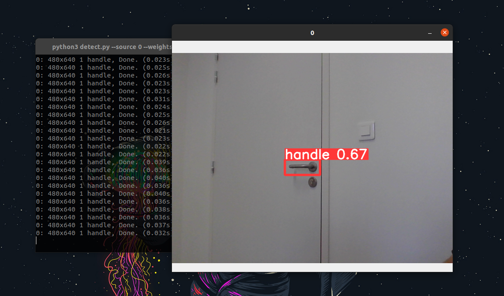

### This documentation explains step-by-step how to train an AI with YoloV5.

## Step 1

To get started, we'll need to clone the YoloV5 folder:
```
git clone https://github.com/ultralytics/yolov5
```  
Then go to the YoloV5 folder and run this command to install all the packages we need:
```
pip install -r requirements.txt
```
## Step 2

We're now going to prepare our data for training our neural network.  
Create a "generateData" folder outside the yoloV5 folder.  
Add a "generateData.py" file and an "image" folder.  
  
To fill our "image" folder, we'll use the following image capture procedure:

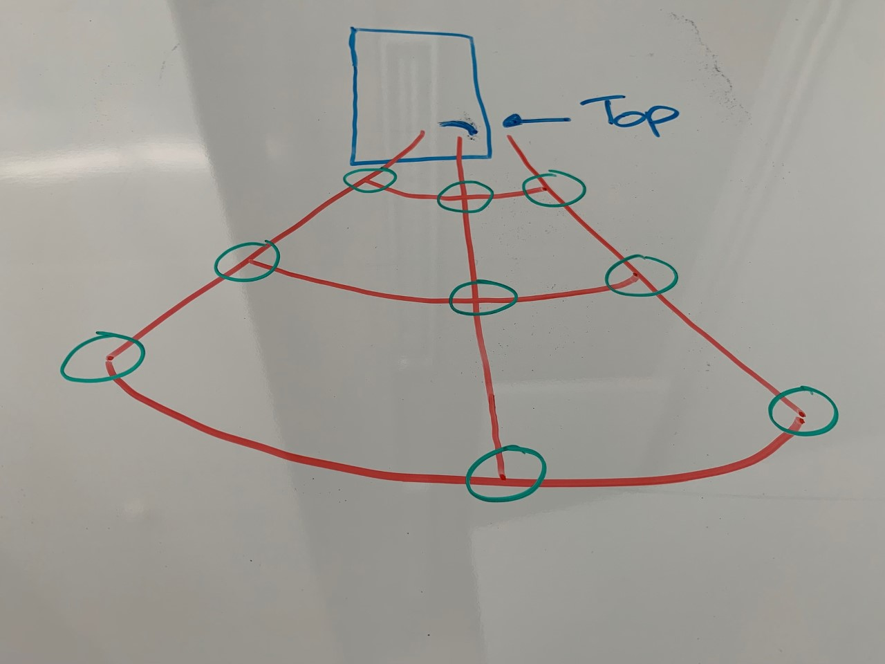  
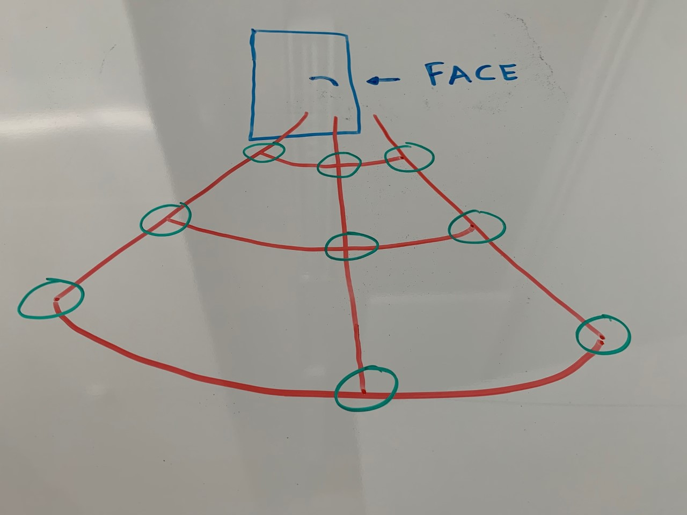  
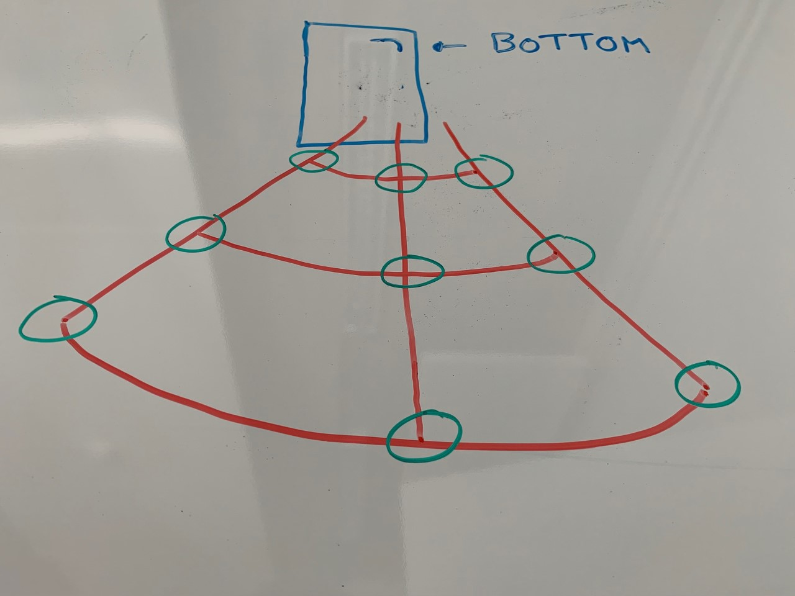 
  
The green circles on the diagrams are the different places to stand to take a photo of the door.  
We note that there are different angles and different distances from the door.   
  
If possible, this procedure should be carried out with different cameras, enabling us to obtain images of different sizes and resolutions:

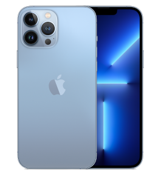
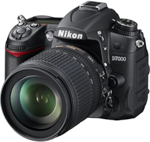
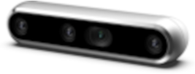

We also want to duplicate images in order to perform color and resolution transformations, or add noise to these duplications. This will considerably increase our data:

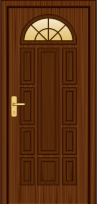
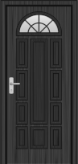
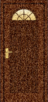
  
If this step is carried out correctly, you'll have a very good chance of obtaining a highly accurate result.

## Step 3

Once we have our images, we'll need to annotate them using the open Cv python library.  
Add the following code to the "generateData.py" python file:  
  
    import cv2
    import sys
    import os
    import pathlib
    from sklearn.model_selection import train_test_split
    import shutil

    mode = ""

    ix,iy = -1,-1
    colors = {'green': (0, 255, 0), 'red': (0, 0, 255)}
    xmin_vals_rectangle = []
    ymin_vals_rectangle = []
    xmax_vals_rectangle = []
    ymax_vals_rectangle = []

    x_vals_point = []
    y_vals_point = []

    def option(event, x, y, flags, param):
        if (mode == "rectangle"):
        draw_rectangle(event, x, y, flags, param)
    elif (mode == "point"):
        draw_point(event, x, y, flags, param)

    def draw_rectangle(event, x, y, flags, param):
        global ix,iy

        if event == cv2.EVENT_LBUTTONDOWN:
            ix,iy = x,y
            xmin_vals_rectangle.append(ix)
            ymin_vals_rectangle.append(iy)
        elif event == cv2.EVENT_LBUTTONUP:
            xmax_vals_rectangle.append(x)
            ymax_vals_rectangle.append(y)
            cv2.rectangle(image,(ix,iy),(x,y), colors['red'], 2)
            print("Do a rectangle or press 'echap' for next image...\n")

    def draw_point(event, x, y, flags, param):
        global ix, iy
        if event == cv2.EVENT_LBUTTONDBLCLK:
            cv2.circle(image, (x, y), 5, colors['green'], -1)
            x_vals_point.append(x)
            y_vals_point.append(y)
            print("Double click another pixel or press 'echap' for next image...\n")

    if __name__ == "__main__":

        folder = sys.argv[1]
        print("Welcome to the Image Annotation Program!\n")
        val = input("Name the folder to retrieve the annotations: ")
        os.makedirs(val)
        print("Press echap for next image\n")
        print("Choose your mode: press p to annotate a point or press r to annotate a rectangle")

        for (folder, subfolder, files) in os.walk(folder):
            size = len(files)
            for file in files:
                xmin_vals_rectangle = []
                ymin_vals_rectangle = []
                xmax_vals_rectangle = []
                ymax_vals_rectangle = []
                img = cv2.imread(os.path.join(folder, file), -1)
                image = cv2.rotate(img, cv2.cv2.ROTATE_90_CLOCKWISE)
                height = image.shape[0]
                width = image.shape[1]
                cv2.namedWindow('Annotation')
                cv2.setMouseCallback('Annotation', option)

                while True:
                    cv2.imshow('Annotation', image)
                    k = cv2.waitKey(1) & 0xFF
                    if k == ord('p'):
                        print("point mode selected")
                        print("Double click anywhere inside the image to annotate that point...\n")
                        mode = "point"
                    elif k == ord('r'):
                        print("rectangle mode selected")
                        mode = "rectangle"
                    elif k == 27:
                        fname = os.path.join(val, pathlib.Path(file).stem + '.txt')
                        with open(fname, "w") as f:
                            print("image: ", size, "/", len(files))
                            size -= 1
                            for i, el in enumerate(xmin_vals_rectangle):
                                x_center = ((xmax_vals_rectangle[i] + xmin_vals_rectangle[i]) / 2) / width
                                y_center = ((ymax_vals_rectangle[i] + ymin_vals_rectangle[i]) / 2) / height
                                width_image = (xmax_vals_rectangle[i] - xmin_vals_rectangle[i]) / width
                                height_image = (ymax_vals_rectangle[i] - ymin_vals_rectangle[i]) / height
                                f.write(f"0 {x_center} {y_center} {width_image} {height_image}\n")
                        break
                cv2.destroyAllWindows()

Usage:  
```
python3 generateData.py "Folder that contains the images".
```  

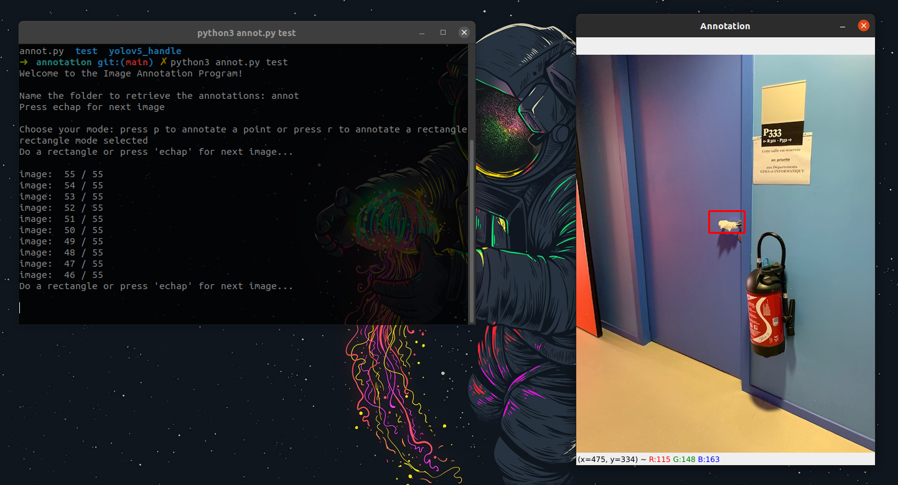

## Step 4

Now we need to prepare the final folder we'll give to YoloV5.  
We're going to create two folders, "images" and "labels", both of which will contain three folders: train, test and Val.  
The aim of the code below is to create all the folders and distribute the images and labels so that the train folder contains 80% of all the images and labels, the test folder 10% and the val folder 10%:   

    import cv2
    import sys
    import os
    import pathlib
    from sklearn.model_selection import train_test_split
    import shutil

    mode = ""

    ix,iy = -1,-1
    colors = {'green': (0, 255, 0), 'red': (0, 0, 255)}
    xmin_vals_rectangle = []
    ymin_vals_rectangle = []
    xmax_vals_rectangle = []
    ymax_vals_rectangle = []

    x_vals_point = []
    y_vals_point = []

    def option(event, x, y, flags, param):
        if (mode == "rectangle"):
            draw_rectangle(event, x, y, flags, param)
        elif (mode == "point"):
            draw_point(event, x, y, flags, param)

    def draw_rectangle(event, x, y, flags, param):
        global ix,iy

        if event == cv2.EVENT_LBUTTONDOWN:
            ix,iy = x,y
            xmin_vals_rectangle.append(ix)
            ymin_vals_rectangle.append(iy)
        elif event == cv2.EVENT_LBUTTONUP:
            xmax_vals_rectangle.append(x)
            ymax_vals_rectangle.append(y)
            cv2.rectangle(image,(ix,iy),(x,y), colors['red'], 2)
            print("Do a rectangle or press 'echap' for next image...\n")

    def draw_point(event, x, y, flags, param):
        global ix, iy
        if event == cv2.EVENT_LBUTTONDBLCLK:
            cv2.circle(image, (x, y), 5, colors['green'], -1)
            x_vals_point.append(x)
            y_vals_point.append(y)
            print("Double click another pixel or press 'echap' for next image...\n")

    if __name__ == "__main__":

        folder = sys.argv[1]
        print("Welcome to the Image Annotation Program!\n")
        val = input("Name the folder to retrieve the annotations: ")
        os.makedirs(val)
        print("Press echap for next image\n")
        print("Choose your mode: press p to annotate a point or press r to annotate a rectangle")

        for (folder, subfolder, files) in os.walk(folder):
            size = len(files)
            for file in files:
                xmin_vals_rectangle = []
                ymin_vals_rectangle = []
                xmax_vals_rectangle = []
                ymax_vals_rectangle = []
                img = cv2.imread(os.path.join(folder, file), -1)
                image = cv2.rotate(img, cv2.cv2.ROTATE_90_CLOCKWISE)
                height = image.shape[0]
                width = image.shape[1]
                cv2.namedWindow('Annotation')
                cv2.setMouseCallback('Annotation', option)

                while True:
                    cv2.imshow('Annotation', image)
                    k = cv2.waitKey(1) & 0xFF
                    if k == ord('p'):
                        print("point mode selected")
                        print("Double click anywhere inside the image to annotate that point...\n")
                        mode = "point"
                    elif k == ord('r'):
                        print("rectangle mode selected")
                        mode = "rectangle"
                    elif k == 27:
                        fname = os.path.join(val, pathlib.Path(file).stem + '.txt')
                        with open(fname, "w") as f:
                            print("image: ", size, "/", len(files))
                            size -= 1
                            for i, el in enumerate(xmin_vals_rectangle):
                                x_center = ((xmax_vals_rectangle[i] + xmin_vals_rectangle[i]) / 2) / width
                                y_center = ((ymax_vals_rectangle[i] + ymin_vals_rectangle[i]) / 2) / height
                                width_image = (xmax_vals_rectangle[i] - xmin_vals_rectangle[i]) / width
                                height_image = (ymax_vals_rectangle[i] - ymin_vals_rectangle[i]) / height
                                f.write(f"0 {x_center} {y_center} {width_image} {height_image}\n")
                        break
                cv2.destroyAllWindows()

        images = folder
        annotations = val

        def move_files_to_folder(list_of_files, destination_folder):
            for f in list_of_files:
                try:
                    shutil.move(f, destination_folder)
                except:
                    print(f)
                    assert False

        ****-------------------------------------------------------------------------------------------------------------------------------------****
        CODE to ADD
                
        imgs = [os.path.join(images, x) for x in os.listdir(images)]
        annots = [os.path.join(annotations, x) for x in os.listdir(annotations) if x[-3:] == "txt"]

        imgs.sort()
        annots.sort()

        train_images, val_images, train_annotations, val_annotations = train_test_split(imgs, annots, test_size = 0.2, random_state = 1)
        val_images, test_images, val_annotations, test_annotations = train_test_split(val_images, val_annotations, test_size = 0.5, random_state = 1)

        if not os.path.exists(images + '/train'):
            os.makedirs(images + '/train')
        if not os.path.exists(images + '/val'):
            os.makedirs(images + '/val')
        if not os.path.exists(images + '/test'):
            os.makedirs(images + '/test')
        if not os.path.exists(annotations + '/train'):
            os.makedirs(annotations + '/train')
        if not os.path.exists(annotations + '/val'):
            os.makedirs(annotations + '/val')
        if not os.path.exists(annotations + '/test'):
            os.makedirs(annotations + '/test')
        move_files_to_folder(train_images, images + '/train')
        move_files_to_folder(val_images, images + '/val')
        move_files_to_folder(test_images, images + '/test')
        move_files_to_folder(train_annotations, annotations + '/train')
        move_files_to_folder(val_annotations, annotations + '/val')
        move_files_to_folder(test_annotations, annotations + '/test')
        if not os.path.exists('detect_data'):
            os.makedirs('detect_data')
        shutil.move(images, "./detect_data/images")
        shutil.move(annotations, "./detect_data/labels")

        ****-------------------------------------------------------------------------------------------------------------------------------------****
        CODE to ADD

You should normally get this result:  

    detect_data
    │   ├── images
    │   │   ├── test
    │   │   │   ├── frontleft_fisheye_image12.jpg
    │   │   │   ├── frontright_fisheye_image11.jpg
    │   │   │   ├── frontright_fisheye_image2.jpg
    │   │   │   └── frontright_fisheye_image9.jpg
    │   │   ├── train
    │   │   │   ├── frontleft_fisheye_image10.jpg
    │   │   │   ├── frontleft_fisheye_image13.jpg
    │   │   │   ├── frontleft_fisheye_image14.jpg
    │   │   │   ├── frontleft_fisheye_image15.jpg
    │   │   │   ├── frontleft_fisheye_image16.jpg
    │   │   │   ├── frontleft_fisheye_image17.jpg
    │   │   │   ├── frontleft_fisheye_image18.jpg
    │   │   │   ├── frontleft_fisheye_image19.jpg
    │   │   │   ├── frontleft_fisheye_image20.jpg
    │   │   │   ├── frontleft_fisheye_image2.jpg
    │   │   │   ├── frontleft_fisheye_image3.jpg
    │   │   │   ├── frontleft_fisheye_image4.jpg
    │   │   │   ├── frontleft_fisheye_image5.jpg
    │   │   │   ├── frontleft_fisheye_image6.jpg
    │   │   │   ├── frontleft_fisheye_image7.jpg
    │   │   │   ├── frontleft_fisheye_image8.jpg
    │   │   │   ├── frontleft_fisheye_image9.jpg
    │   │   │   ├── frontleft_fisheye_image.jpg
    │   │   │   ├── frontright_fisheye_image12.jpg
    │   │   │   ├── frontright_fisheye_image13.jpg
    │   │   │   ├── frontright_fisheye_image14.jpg
    │   │   │   ├── frontright_fisheye_image15.jpg
    │   │   │   ├── frontright_fisheye_image17.jpg
    │   │   │   ├── frontright_fisheye_image19.jpg
    │   │   │   ├── frontright_fisheye_image20.jpg
    │   │   │   ├── frontright_fisheye_image3.jpg
    │   │   │   ├── frontright_fisheye_image4.jpg
    │   │   │   ├── frontright_fisheye_image5.jpg
    │   │   │   ├── frontright_fisheye_image6.jpg
    │   │   │   ├── frontright_fisheye_image7.jpg
    │   │   │   ├── frontright_fisheye_image8.jpg
    │   │   │   └── frontright_fisheye_image.jpg
    │   │   └── val
    │   │       ├── frontleft_fisheye_image11.jpg
    │   │       ├── frontright_fisheye_image10.jpg
    │   │       ├── frontright_fisheye_image16.jpg
    │   │       └── frontright_fisheye_image18.jpg
    │   └── labels
    │       ├── test
    │       │   ├── frontleft_fisheye_image12.txt
    │       │   ├── frontright_fisheye_image11.txt
    │       │   ├── frontright_fisheye_image2.txt
    │       │   └── frontright_fisheye_image9.txt
    │       ├── train
    │       │   ├── frontleft_fisheye_image10.txt
    │       │   ├── frontleft_fisheye_image13.txt
    │       │   ├── frontleft_fisheye_image14.txt
    │       │   ├── frontleft_fisheye_image15.txt
    │       │   ├── frontleft_fisheye_image16.txt
    │       │   ├── frontleft_fisheye_image17.txt
    │       │   ├── frontleft_fisheye_image18.txt
    │       │   ├── frontleft_fisheye_image19.txt
    │       │   ├── frontleft_fisheye_image20.txt
    │       │   ├── frontleft_fisheye_image2.txt
    │       │   ├── frontleft_fisheye_image3.txt
    │       │   ├── frontleft_fisheye_image4.txt
    │       │   ├── frontleft_fisheye_image5.txt
    │       │   ├── frontleft_fisheye_image6.txt
    │       │   ├── frontleft_fisheye_image7.txt
    │       │   ├── frontleft_fisheye_image8.txt
    │       │   ├── frontleft_fisheye_image9.txt
    │       │   ├── frontleft_fisheye_image.txt
    │       │   ├── frontright_fisheye_image12.txt
    │       │   ├── frontright_fisheye_image13.txt
    │       │   ├── frontright_fisheye_image14.txt
    │       │   ├── frontright_fisheye_image15.txt
    │       │   ├── frontright_fisheye_image17.txt
    │       │   ├── frontright_fisheye_image19.txt
    │       │   ├── frontright_fisheye_image20.txt
    │       │   ├── frontright_fisheye_image3.txt
    │       │   ├── frontright_fisheye_image4.txt
    │       │   ├── frontright_fisheye_image5.txt
    │       │   ├── frontright_fisheye_image6.txt
    │       │   ├── frontright_fisheye_image7.txt
    │       │   ├── frontright_fisheye_image8.txt
    │       │   └── frontright_fisheye_image.txt
    │       └── val
    │           ├── frontleft_fisheye_image11.txt
    │           ├── frontright_fisheye_image10.txt
    │           ├── frontright_fisheye_image16.txt
    │           └── frontright_fisheye_image18.txt

## Step 5

Move the "detect_data" folder to the root of the YoloV5 folder:  
```
mv detect_data yoloV5/
```  
We can start training the neural network with the following command (to be run from the root of the yolov5 folder):
```
python3 train.py --img 640 --cfg yolov5s.yaml --hyp hyp.scratch-high.yaml --batch 16 --epochs 50 --data detect_data.yaml --weights yolov5s.pt --workers 24 --name handle_det_test
```  
The training result will be stored in:
```
runs/train
```  

Detection can be carried out in two ways:  
  
- Using the test folder created in detect_data/images/test with the command:  
```
python3 detect.py --source detect_data/images/test --weights ./runs/train/handle_det_test/weights/best.pt --conf 0.25 --name handel_det_test
```  
The detection result will be stored in:
```
runs/detect
```  
- Using the computer camera with the command:  

```
python3 detect.py --source 0 --weights ./runs/train/handle_det_test/weights/best.pt --conf 0.25 --name handel_det_test
```  

## Documentation Used

Go to [Paperspace](https://blog.paperspace.com/train-yolov5-custom-data/) !
