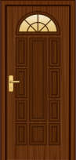
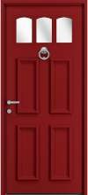
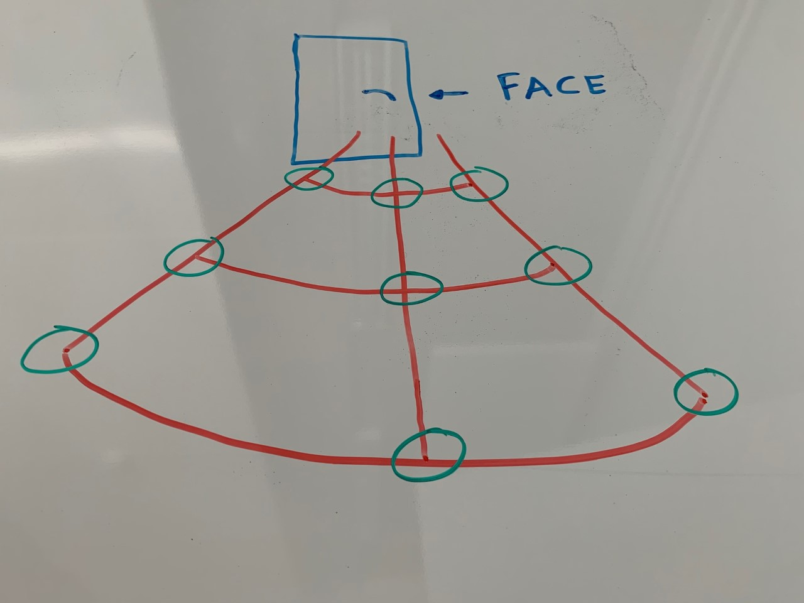
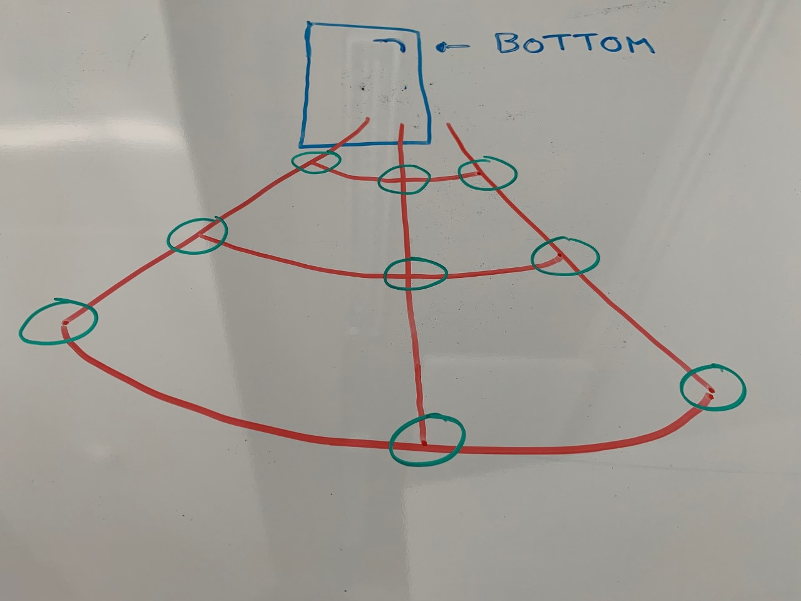
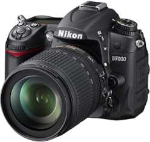
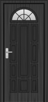
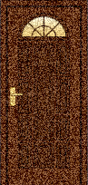

# Procedure documentation for image detection

### This documentation will explain step by step the training process to perform recognition on images from various sensors.  
### We will take the example of a door to detect the handle.

## Step 1

To start, we will need to capture images for training.  
We will have to take pictures of several wears with different colors, shapes and handles.

  

The procedure for taking images is as follows (which applies for one door face):

  
  
  

The green circles on the diagrams are the different places where you have to stand to take a picture of the door. We notice that there are different angles and different distances from the door.  
With this procedure, we can cover the entire door and have a maximum of data.  

This procedure must be carried out with different cameras:

Using several sensors will allow us to obtain images of different sizes and different resolutions.

The objective of this procedure is to be able to do our final test with a camera not used for the tests and that the recognition works (Like for example the front camera of the Boston Dynamics spot in our case).  

  

## Step 2

The objective of this step will be to annotate all the images taken by the different sensors.  

  
  

It is necessary to avoid noise as much as possible, annotate only the element that you want to recognize (In our case, it is necessary to avoid framing the lock as much as possible).

## Step 3

The objective of this step will be to create a python script to duplicate the images to realize color and resolution transformations or even add noise to its duplications. This will significantly increase our data.  

